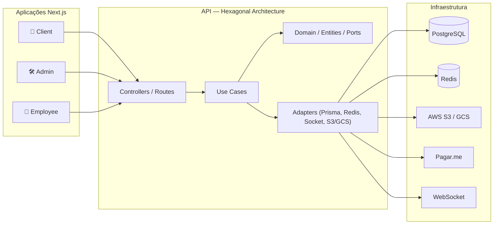

<div align="center">

# Banca Digital — Marketplace de Revistas e Conteúdo

**Plataforma Fullstack Multi-aplicação para Venda e Leitura de Revistas Digitais e Físicas**


</div>

---

## ⚠️ Status do Projeto

Este projeto **não está online no momento**. O desenvolvimento foi interrompido porque o cliente deixou de dar retorno durante o processo — o sistema não chegou a ir ao ar em produção com usuários reais, embora estivesse funcionalmente avançado e com ambiente de deploy via Docker já preparado.

O repositório é **privado**. Este README documenta a arquitetura e os principais módulos implementados, com trechos de código reais extraídos do projeto.

---

## 🧩 Sobre o Projeto

A **Banca Digital** é um marketplace de revistas — venda de assinaturas e edições avulsas nos formatos **digital** e **físico**, com leitura integrada no navegador (efeito de folhear página, estilo revista real) e um sistema de monetização em três camadas: **afiliados** (indicação com código de cupom e sistema de graduação/pontos), **DVLs — Divisões de Lucro** (repasse a colaboradores/parceiros de conteúdo) e **comissão de colaboradores internos**.

O sistema é um **monorepo com 4 aplicações independentes**, cada uma com seu próprio propósito:

| App | Público-alvo | Função |
| :--- | :--- | :--- |
| `client` | Usuário final | Loja, leitura de revistas, assinatura, área de afiliado |
| `admin` | Administração | Gestão de conteúdo, pedidos, patrocinadores, colaboradores |
| `employee` | Colaboradores internos | Acompanhamento de comissões e biblioteca de conteúdo |
| `api` | — | Núcleo de regras de negócio, em Arquitetura Hexagonal |

---

## 🏗️ Arquitetura Geral



Cada serviço roda em seu próprio container Docker, com **duas redes isoladas** (`frontend_net` e `backend_net`) — o banco de dados e o Redis não são acessíveis diretamente pelos front-ends, apenas pela API:

```yaml
services:
  api:
    build: ./api
    depends_on: [database]
    networks: [backend_net, frontend_net]
    ports: ["3333:8000"]

  admin:
    build: ./admin
    networks: [frontend_net]
    ports: ["3001:3000"]

  client:
    build: ./client
    networks: [frontend_net]
    ports: ["3002:3000"]

  redis:
    image: redis:alpine
    networks: [backend_net]

networks:
  frontend_net:
    driver: bridge
  backend_net:
    driver: bridge
```

---

## 🔍 Destaques Técnicos — API (Núcleo do Sistema)

**520 arquivos TypeScript**, organizados em Arquitetura Hexagonal com **30 modelos de domínio** no Prisma e **167 dependências registradas** no container de injeção de dependência (TSyringe).

### 1. Injeção de dependência centralizada com TSyringe

Todo repositório, serviço e caso de uso é registrado como interface (port) e resolvido em tempo de execução — o domínio nunca depende de implementação concreta (Prisma, Redis, etc.), apenas de contratos.

```ts
import { container } from "tsyringe";

container.registerSingleton<UserRepositoryInterface>(
  "UserRepositoryInterface",
  PrismaUserRepository
);
container.registerSingleton<AffiliatesRepositoryInterface>(
  "AffiliatesRepositoryInterface",
  PrismaAffiliatesRepository
);
container.registerSingleton<CreateAffiliateUseCaseInterface>(
  "CreateAffiliateUseCaseInterface",
  CreateAffiliateUseCase
);
// ...mais de 160 registros seguindo o mesmo padrão de porta + adaptador
```

> Nota honesta: o container cresceu para **mais de 1.400 linhas** em um único arquivo. Funciona bem, mas hoje eu dividiria os registros por módulo de domínio (um container por contexto) para manter a legibilidade em um projeto desse porte.

### 2. Redis como estrutura de dados para notificações em tempo real (não apenas cache)

Em vez de usar Redis só como cache, o sistema usa listas (`lPush`/`lRange`) para manter um feed de notificações por usuário, com expiração automática de 7 dias.

```ts
@injectable()
export class RedisNotificationRepository implements RedisNotificationRepositoryInterface {
  constructor(@inject("RedisClient") private readonly redis: RedisClientType) {}

  async create(input: Notification): Promise<void> {
    const key = `notifications:user:${input.userId}`;
    await this.redis.lPush(key, JSON.stringify(input));
    await this.redis.expire(key, 60 * 60 * 24 * 7);
  }

  async findNotificationUser(userId: string): Promise<any> {
    const key = `notifications:user:${userId}`;
    const items = await this.redis.lRange(key, 0, -1);
    return items.map((i) => JSON.parse(i));
  }
}
```

### 3. Notificações em tempo real via WebSocket com salas por usuário

Cada usuário autenticado entra em uma "sala" própria (`user_${userId}`) no Socket.IO, permitindo emitir notificações direcionadas sem broadcast desnecessário para todos os clientes conectados.

```ts
this.io.on("connection", (socket) => {
  socket.on("register", async (userId: string) => {
    if (!userId) return;
    const existUser = await this.userRepo.findId(userId);
    if (!existUser) return socket.disconnect();
    socket.join(`user_${userId}`);
  });
});
```

### 4. Autenticação em duas camadas: JWT + Refresh Token com verificação em banco

O refresh token não é apenas validado por assinatura — é conferido contra um registro em banco, permitindo revogação ativa (logout forçado, por exemplo) mesmo com um token ainda válido criptograficamente.

```ts
checkSecretHeader = async (http: MiddlewareRequest) => {
  const secret = process.env.SECRETREFRESH;
  const token = http.req.headers.authorization?.split(" ")[1];

  if (!token) return http.next(new NotFoundError("Token de segurança não encontrado!"));

  const payload = this.jwt.verifyToken(token, secret as string) as { sub: string };
  const refreshToken = await this.refreshTokenRepo.findById(payload.sub);

  if (!refreshToken) {
    return http.next(new NotFoundError("Token de segurança não encontrado!"));
  }
  http.req.user = refreshToken.token;
  return http.next();
};
```

### 5. Autenticação em dois fatores (2FA) com TOTP

Implementação de 2FA via `otplib`, compatível com apps como Google Authenticator — gera segredo em Base32, QR code e valida o token em janela de tempo customizada.

```ts
@injectable()
export class OtpLibraryServiceAdapter {
  generateKeyURI(accountName: string, issuer: string, secret: string): string {
    return authenticator.keyuri(accountName, issuer, secret);
  }

  verifyToken(token: string, secret: string): boolean {
    this.loadOptions();
    return authenticator.verify({ token, secret });
  }

  private loadOptions(): void {
    authenticator.options = {
      digits: 6,
      step: 1800,
      algorithm: "sha256" as any,
    };
  }
}
```

### 6. Sistema de afiliados com código único e graduação

Cada usuário pode gerar um código de afiliado único (impedindo duplicidade), que evolui por níveis de graduação conforme performance de vendas — sistema de gamificação sobre a base de indicação.

```ts
async execute(userId: string): Promise<string> {
  const checkExistCupom = await this.affiRepo.findByUser(userId);
  if (checkExistCupom) throw new Conflict("Usuario ja possui um codigo de afiliado!");

  const code = randomBytes(9).toString("hex").slice(0, 9);
  const newAffiliate = Affiliates.create({
    graduation: "inicial",
    name: `CODE_${code}`,
    points: 0,
    seller: 0,
    userId,
  });
  await this.affiRepo.create(newAffiliate);
  return "Codigo de afiliado criado com sucesso!";
}
```

### 7. Precificação diferenciada por modelo de produto (digital vs. físico)

O mesmo pedido pode misturar itens digitais e físicos, cada um com sua própria regra de preço, calculado dinamicamente no momento do checkout a partir do carrinho.

```ts
const order = magazines.map((data, index) => {
  const items = input.cart[index].model;
  const price = items === "DIGITAL" ? data.priceModel : data.priceFisico;
  return {
    code: data.id,
    description: `${data.name} ${items}`,
    quantity: 1,
    amount: price * 100,
  };
});
```

### 8. Rate limiting em rotas sensíveis

Proteção contra força bruta em endpoints críticos (login, recuperação de senha), limitando a 5 tentativas a cada 15 minutos por IP.

```ts
export const limiter = rateLimit({
  windowMs: 15 * 60 * 1000,
  max: 5,
  message: {
    status: 429,
    error: "Too Many Requests",
    message: "Você foi temporariamente bloqueado. Tente novamente mais tarde.",
  },
  standardHeaders: true,
  legacyHeaders: false,
});
```

### 9. Testes unitários com Jest e mocks de entidade

```ts
describe("CreateEventUseCase", () => {
  it("deve criar um novo evento com sucesso", async () => {
    (Events.create as jest.Mock).mockReturnValue(mockEvent);
    const useCase = new CreateEventUseCase();
    const result = await useCase.execute(mockEvent);

    expect(Events.create).toHaveBeenCalledWith(mockEvent);
    expect(result).toBe("Evento criado com sucesso");
  });
});
```

> Nota honesta: a cobertura de testes automatizados é **pontual** (casos de uso de eventos), não abrange o sistema inteiro. Havia também um payload preparado para testes de carga com k6, mas o script de execução não chegou a ser implementado antes do projeto pausar.

---

## 🔍 Destaques Técnicos — Client (Loja + Leitor de Revistas)

**172 arquivos**, Next.js App Router.

### 1. Leitor de revista com efeito de folhear página (estilo revista real)

O núcleo da experiência de leitura: renderização de PDF com efeito de virar página em 3D (via biblioteca FlipBook + Three.js + pdf.js), incluindo som de folha virando.

```tsx
const book = new $("#container").FlipBook({
  pdf: pdf,
  controlsProps: {
    loadingAnimation: { book: false },
    cmdPrint: { print: false },
    share: false,
  },
  template: {
    html: "/templates/default-book-view.html",
    script: "/js/libs/pdf.worker.js",
    sounds: {
      startFlip: "/sounds/start-flip.mp3",
      endFlip: "/sounds/end-flip.mp3",
    },
  },
});
```

### 2. Estrutura de rotas orientada a contexto de negócio

```
app/
├── articles/explorer/{free,most-views,recommended,trend}   # curadoria de conteúdo
├── checkout/{buy,affiliates/[id]}                           # dois fluxos de compra
├── library/collections/{articles,magazine}                  # biblioteca do usuário
├── settings/afiliates/{graduation,links,sales-data,withdraw} # painel de afiliado
└── settings/dvls/{finance-overview,withdraw-dvls}            # painel de divisão de lucro
```

Cada domínio de negócio (afiliados, DVLs, biblioteca) tem sua própria árvore de rotas isolada, refletindo diretamente os módulos da API.

---

## 📦 Panorama da Arquitetura — Backend

- **Módulos de domínio:** contas, autenticação (JWT + refresh + 2FA), usuários, admin, colaboradores, afiliados, DVLs, revistas, artigos, categorias, banners, eventos, patrocinadores, pedidos, pagamentos, upload, notificações, logs
- **30 modelos** no schema Prisma, com **9 migrations incrementais** documentando a evolução real do banco
- **Integrações externas:** Pagar.me (checkout), AWS S3 + Google Cloud Storage (upload de arquivos, dupla opção), Twilio (SMS), Nodemailer (e-mail transacional), Google OAuth
- **Padrões aplicados:** Clean/Hexagonal Architecture (domain/application/infrastructure), Repository Pattern, injeção de dependência via TSyringe, DTOs com validação Zod, logging estruturado com Winston

---

## 🛠️ Stack Tecnológica

| Camada | Tecnologias |
| :--- | :--- |
| **Backend** | Node.js, Express, TypeScript, Prisma ORM, PostgreSQL |
| **Frontend (x3 apps)** | Next.js, React, TanStack Query |
| **Tempo real** | Socket.IO, Redis |
| **Autenticação** | JWT, Refresh Token, 2FA (TOTP), Google OAuth, NextAuth |
| **Pagamentos** | Pagar.me |
| **Armazenamento** | AWS S3, Google Cloud Storage |
| **Comunicação** | Nodemailer, Twilio (SMS) |
| **Infraestrutura** | Docker, Docker Networks (isolamento front/back), Redis |
| **Qualidade** | Jest, Zod, Winston (logging estruturado) |

---

<div align="center">

### Desenvolvido por Tiago Ramon Becker
[🔗 Acessar Portfólio](https://tiagobecker.vercel.app)

</div>
